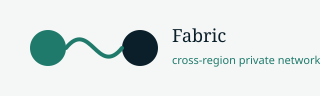

# Cross-Region Private Networking

<p align="center">
  
</p>

<p align="center">
  <a href="https://github.com/theworker02/cross-region-private-networking/releases/tag/v1.0.0"></a>
  <a href="https://github.com/theworker02/cross-region-private-networking/actions/workflows/pages.yml"></a>
  
  
  <a href="https://theworker02.github.io/cross-region-private-networking/"></a>
</p>

**Global identity-aware private fabric that extends Render’s same-region private networking across regions.**

> **Independent project; not affiliated with Render.**  
> Render already provides excellent same-region private networks. This product adds cross-region names, rustls mTLS identity, path classification, and policy — preferring native private hostnames in-region (`LOCAL_NATIVE`).

| | |
|---|---|
| **Version** | **1.0.0** acquisition release |
| **Repo** | https://github.com/theworker02/cross-region-private-networking |
| **Live site** | https://theworker02.github.io/cross-region-private-networking/ |
| **Demo** | https://theworker02.github.io/cross-region-private-networking/demo.html (**SIMULATION**) |
| **About** | https://theworker02.github.io/cross-region-private-networking/about.html |
| **Target (Render)** | https://theworker02.github.io/cross-region-private-networking/render.html |
| **Contact** | https://theworker02.github.io/cross-region-private-networking/contact.html |
| **License** | Proprietary — use only after written commercial license **or** completed acquisition ([`LICENSE`](./LICENSE)) |
| **Evaluate** | `.\evaluate.ps1` or `./evaluate.sh` → `evaluation/` |
| **Readiness** | [`ACQUISITION_READINESS_REPORT.md`](./ACQUISITION_READINESS_REPORT.md) |

## Problem

Render private networking is **region-scoped**. Workloads in Virginia cannot privately address services in Frankfurt over Render’s internal network alone. Teams often fall back to public networking plus app-level auth.

## Architecture (one glance)

```
[VA private net]                         [FRA private net]
  apps → fabric-node-va ══ rustls mTLS ══ fabric-node-fra ← apps
           │                                      │
     *.internal / *.global.internal          discovery + policy
     LOCAL_NATIVE in-region · FABRIC_* cross-region
```

## Quick start

```powershell
cargo test --workspace
.\evaluate.ps1
cargo run -p fabric-cli -- resolve payments.global.internal
cargo run -p fabric-cli -- doctor
```

## Render fit

Extends the same-region private network model with global names and authenticated fabric paths. **Not affiliated with Render.** Gap matrix: [`docs/RENDER_GAP_MATRIX.md`](./docs/RENDER_GAP_MATRIX.md).

## Acquisition notice

Diligence: [`acquisition/`](./acquisition/). One-pager: [`ACQUISITION.md`](./ACQUISITION.md).  
**No production use** until written commercial license or completed acquisition/asset transfer. Contact via [GitHub `@theworker02`](https://github.com/theworker02) — see [Contact page](https://theworker02.github.io/cross-region-private-networking/contact.html).

## License

**Proprietary — sale / acquisition only.** See [`LICENSE`](./LICENSE).

---

*© 2026 [Rightsholder]. All rights reserved. Independent project; not affiliated with Render.*
